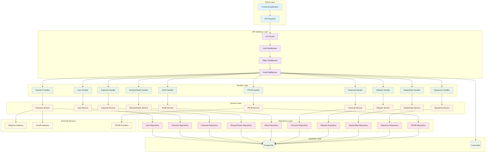
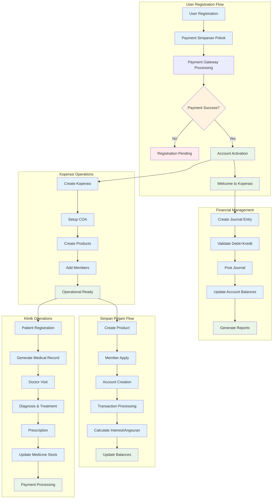

#  Koperasi Merah Putih

Aplikasi manajemen koperasi berbasis Go untuk pengelolaan koperasi di Indonesia dengan fitur lengkap mulai dari manajemen anggota, simpan pinjam, klinik, hingga akuntansi.

## Gambaran Sistem

Sistem ini dikembangkan khusus untuk kebutuhan koperasi di Indonesia dengan mempertimbangkan regulasi dan praktik bisnis lokal. Aplikasi menyediakan solusi terintegrasi untuk operasional koperasi sehari-hari.

## Fitur Utama

### Manajemen Koperasi
- Registrasi dan pengelolaan data koperasi
- Manajemen anggota dengan sistem keanggotaan bertingkat
- Validasi NIK dan data wilayah Indonesia
- Generate NIAK otomatis sesuai standar

### Simpan Pinjam
- Produk simpanan dan pinjaman yang fleksibel
- Perhitungan bunga dan angsuran otomatis
- Tracking jatuh tempo dan tunggakan
- Laporan keuangan anggota

### Klinik
- Manajemen pasien dan rekam medis
- Jadwal praktik tenaga medis
- Inventory obat dengan alert stok minimum
- Sistem resep dan billing terintegrasi

### Akuntansi & Keuangan
- Chart of Account (COA) sesuai standar akuntansi Indonesia
- Jurnal umum dengan validasi debit-kredit
- Laporan keuangan: Neraca, Laba Rugi, Neraca Saldo
- Posting dan reversal jurnal

### PPOB (Payment Point Online Bank)
- Integrasi dengan penyedia layanan PPOB
- Transaksi pulsa, token listrik, PDAM, dll
- Settlement otomatis dan rekonsiliasi

### Payment Gateway
- Integrasi Midtrans dan Xendit
- Pembayaran simpanan pokok saat registrasi
- Callback handling dan verifikasi otomatis

## Tech Stack

### Backend
- **Language**: Go 1.19+
- **Framework**: Gin Web Framework
- **ORM**: GORM v2
- **Database**: PostgreSQL (primary), Apache Cassandra (analytics)
- **Authentication**: JWT dengan bcrypt

### External Services
- Midtrans & Xendit untuk payment gateway
- Provider PPOB untuk layanan pembayaran
- API wilayah Indonesia untuk validasi alamat

## Arsitektur Sistem

### System Architecture Flow



### Business Process Flow



## Struktur Project

```
internal/
├── handlers/          # HTTP request handlers
├── services/          # Business logic layer
├── repository/        # Data access layer
├── models/           # Database models
├── middleware/       # Authentication, RBAC, audit
└── routes/           # Route definitions

cmd/
└── server/           # Application entry point
```

## Setup Development

### Prerequisites
- Go 1.19 atau lebih baru
- PostgreSQL 13+
- Apache Cassandra 4.0+ (optional, untuk analytics)

### Installation

1. Clone repository
```bash
git clone https://github.com/fdciabdul/Go-Koperasi-Merah-Putih
cd Go-Koperasi-Merah-Putih
```

2. Install dependencies
```bash
go mod download
```

3. Setup database
```bash
# PostgreSQL
createdb koperasi_db

# Jalankan migrasi
go run cmd/migrate/main.go
```

4. Configuration
```bash
cp .env.example .env
# Edit konfigurasi database dan API keys
```

5. Run application
```bash
go run cmd/server/main.go
```

## API Documentation

Server berjalan di `http://localhost:8080` dengan endpoint utama:

### Public Endpoints
- `POST /api/v1/users/register` - Registrasi user baru
- `POST /api/v1/payments/*/callback` - Callback payment gateway

### Koperasi Management
- `POST /api/v1/koperasi` - Buat koperasi baru
- `GET /api/v1/koperasi` - List koperasi
- `POST /api/v1/koperasi/anggota` - Tambah anggota

### Financial
- `POST /api/v1/financial/coa/akun` - Buat akun COA
- `POST /api/v1/financial/jurnal` - Input jurnal
- `GET /api/v1/financial/:id/neraca-saldo` - Neraca saldo

### Klinik
- `POST /api/v1/klinik/pasien` - Registrasi pasien
- `POST /api/v1/klinik/kunjungan` - Input kunjungan
- `GET /api/v1/klinik/:id/statistik` - Statistik klinik

Dokumentasi lengkap API tersedia di `/swagger` setelah aplikasi berjalan.

## Database Design

### PostgreSQL Tables
- User management: `users`, `user_registrations`, `user_payments`
- Koperasi: `koperasi`, `anggota_koperasi`
- Financial: `coa_akun`, `jurnal_umum`, `jurnal_detail`
- Klinik: `klinik_pasien`, `klinik_kunjungan`, `klinik_obat`
- Master data: `kbli`, `jenis_koperasi`, `bentuk_koperasi`

### Cassandra Tables
- Audit logs: `audit_logs`, `user_activities`
- Analytics: `transaction_metrics`, `performance_logs`

## Security

Sistem menggunakan middleware berlapis untuk keamanan:

1. **Authentication**: JWT token validation
2. **RBAC**: Role-based access control
3. **Audit**: Logging semua aktivitas user
4. **Validation**: Input sanitization dan validation

## Deployment

### Docker
```bash
docker build -t koperasi-app .
docker run -p 8080:8080 koperasi-app
```

### Environment Variables
```env
DB_HOST=localhost
DB_PORT=5432
DB_NAME=koperasi_db
DB_USER=postgres
DB_PASSWORD=yourpassword
JWT_SECRET=your-jwt-secret
MIDTRANS_SERVER_KEY=your-midtrans-key
XENDIT_SECRET_KEY=your-xendit-key
```

## Testing

```bash
# Unit tests
go test ./...

# Integration tests
go test -tags=integration ./...

# Coverage report
go test -cover ./...
```

## Contributing

1. Fork repository
2. Buat feature branch (`git checkout -b feature/new-feature`)
3. Commit changes (`git commit -m 'Add new feature'`)
4. Push branch (`git push origin feature/new-feature`)
5. Buat Pull Request

## License

MIT License - lihat file LICENSE untuk detail lengkap.

## Support

Untuk pertanyaan atau issue, silakan buat issue di repository ini atau hubungi tim development.